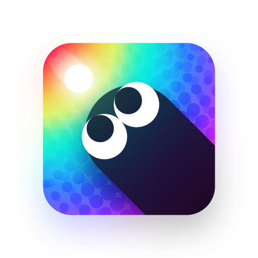

  

    
🌐 Language

    

      

        <a href="https://openaitx.github.io/view.html?user=littensy&project=slither&lang=en">English</a>
        | <a href="https://openaitx.github.io/view.html?user=littensy&project=slither&lang=zh-CN">简体中文</a>
        | <a href="https://openaitx.github.io/view.html?user=littensy&project=slither&lang=zh-TW">繁體中文</a>
        | <a href="https://openaitx.github.io/view.html?user=littensy&project=slither&lang=ja">日本語</a>
        | <a href="https://openaitx.github.io/view.html?user=littensy&project=slither&lang=ko">한국어</a>
        | <a href="https://openaitx.github.io/view.html?user=littensy&project=slither&lang=hi">हिन्दी</a>
        | <a href="https://openaitx.github.io/view.html?user=littensy&project=slither&lang=th">ไทย</a>
        | <a href="https://openaitx.github.io/view.html?user=littensy&project=slither&lang=fr">Français</a>
        | <a href="https://openaitx.github.io/view.html?user=littensy&project=slither&lang=de">Deutsch</a>
        | <a href="https://openaitx.github.io/view.html?user=littensy&project=slither&lang=es">Español</a>
        | <a href="https://openaitx.github.io/view.html?user=littensy&project=slither&lang=it">Italiano</a>
        | <a href="https://openaitx.github.io/view.html?user=littensy&project=slither&lang=ru">Русский</a>
        | <a href="https://openaitx.github.io/view.html?user=littensy&project=slither&lang=pt">Português</a>
        | <a href="https://openaitx.github.io/view.html?user=littensy&project=slither&lang=nl">Nederlands</a>
        | <a href="https://openaitx.github.io/view.html?user=littensy&project=slither&lang=pl">Polski</a>
        | <a href="https://openaitx.github.io/view.html?user=littensy&project=slither&lang=ar">العربية</a>
        | <a href="https://openaitx.github.io/view.html?user=littensy&project=slither&lang=fa">فارسی</a>
        | <a href="https://openaitx.github.io/view.html?user=littensy&project=slither&lang=tr">Türkçe</a>
        | <a href="https://openaitx.github.io/view.html?user=littensy&project=slither&lang=vi">Tiếng Việt</a>
        | <a href="https://openaitx.github.io/view.html?user=littensy&project=slither&lang=id">Bahasa Indonesia</a>
      

    

  

<h3 align="center">
    
     
    Slither
</h3>

    A casual game with a soothing Catppuccin color palette 🎨

    

&nbsp;

## ❤️ Gratitude

This project is based on and heavily inspired by:

-   🎨 [Catppuccin](https://catppuccin.com): A community-driven pastel color palette
-   🎧 [kenney.nl](https://kenney.nl): Thousands of free game assets
-   😜 [Microsoft Fluent Emoji](https://github.com/microsoft/fluentui-emoji): A collection of emoji, used in badges

## 🧑‍💻 Contributors

Special thanks to these contributors for making this possible:

-   [@Inversion](https://github.com/neoinversion) for making awesome pull requests
-   [@pashleyy](https://github.com/passhley) for the concept

---

Slither is released under the <a href="LICENSE.md">MIT License</a>.

